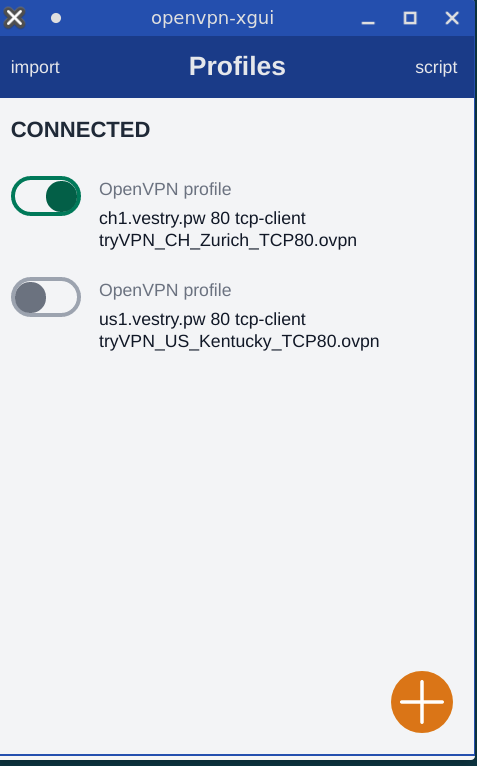

# openvpn-xgui

## version 0.1: dont use this on production 

unofficial cross-platform OpenVPN GUI client
this is a prototype designed for Linux

notice: this application is based on openvpn3 so make sure 
that you have openvpn3 pre-installed



## install perquisites

for installing openvpn3 on Debian / Ubunto:

    sudo apt install -y openvpn3

for installing openvpn3 on RHEL / centos / fedora

    su -
    yum install -y openvpn3

## Project setup
```
npm install
```

### Compiles and hot-reloads for development
```
npm run serve
```

### Compiles and minifies for production
```
npm run build
```

### Lints and fixes files
```
npm run lint
```